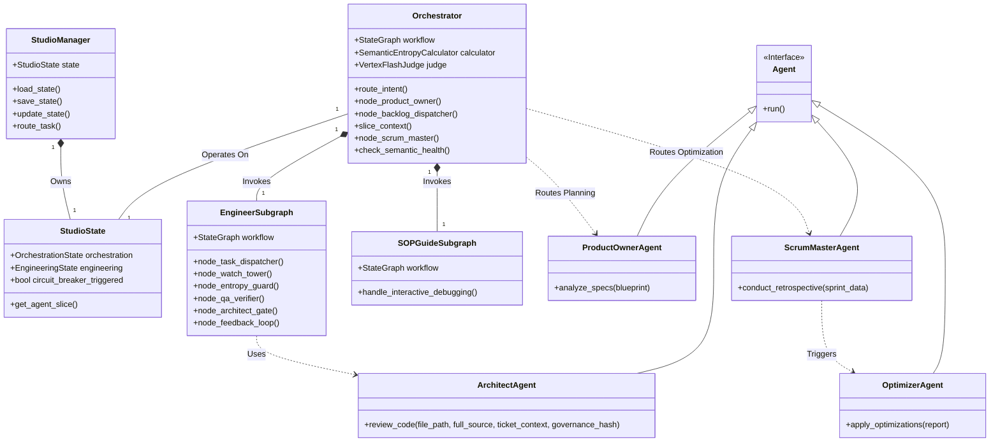
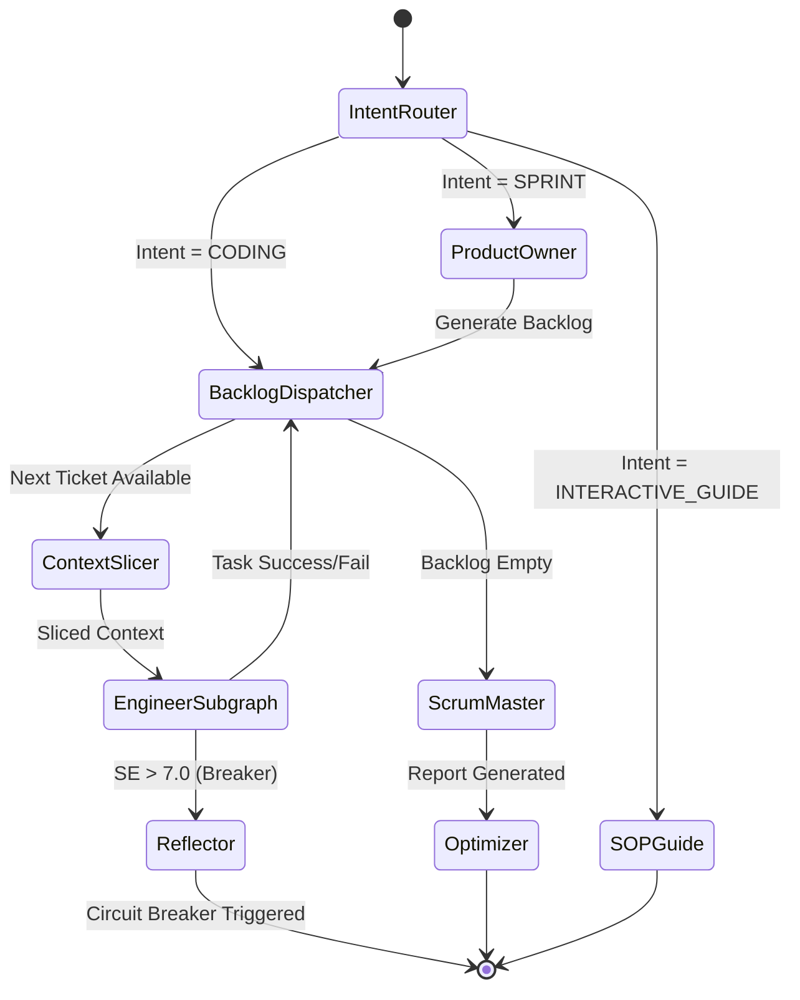
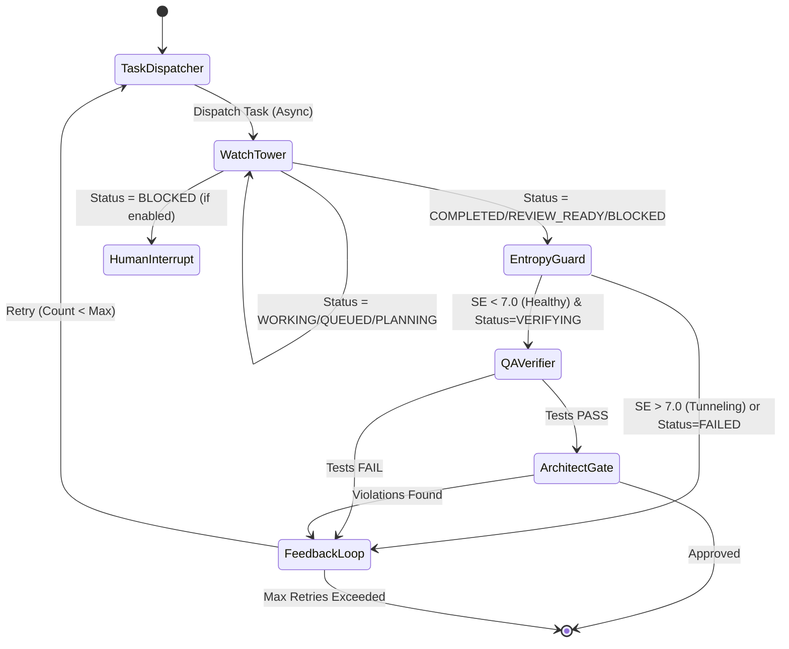

# Software Design Document - Studio Team

## Overview
The Studio is a "Recursive Cognitive Software Factory" designed to automate software engineering tasks with high reliability and low error amplification. It employs a **Centralized Architecture** where a central `Orchestrator` manages state transitions and routes tasks to specialized agents. The system emphasizes:
-   **Context Slicing**: Isolating agents with only the necessary information to prevent context collapse.
-   **Circuit Breakers**: Using "Semantic Entropy" to detect and interrupt cognitive tunneling (hallucination loops).
-   **State Sovereignty**: A single `StudioManager` owns the persistence layer (`studio_state.json`), ensuring data integrity.
-   **Micro-Loop Architecture**: The engineering process follows a strict Dispatch -> Watch -> Monitor -> Verify -> Feedback loop.
-   **Optimization by PROmpting (OPRO)**: The system self-corrects via the `OptimizerAgent`, which patches agent prompts based on retrospective insights.

## System Architecture

The core of the system is the `Orchestrator`, which manages the workflow defined in a `LangGraph` state graph. The `StudioManager` handles the persistence of the `StudioState`. Agents are invoked as nodes within the graph or subgraphs.

### Class Diagram

### Key Components

1.  **StudioManager (`studio/manager.py`)**:
    -   **Role**: State Owner.
    -   **Responsibilities**: Handles loading/saving `studio_state.json`, ensuring atomic writes, and initializing the default state.
2.  **Orchestrator (`studio/orchestrator.py`)**:
    -   **Role**: Runtime Executive.
    -   **Responsibilities**: Defines the high-level workflow graph, routes intents (Coding, Interactive Guide), and enforces the "Circuit Breaker" based on semantic entropy.
3.  **StudioState (`studio/memory.py`)**:
    -   **Role**: Single Source of Truth.
    -   **Responsibilities**: Pydantic models defining the entire system state, including orchestration status, engineering artifacts, and agent metadata.
4.  **EngineerSubgraph (`studio/subgraphs/engineer.py`)**:
    -   **Role**: The "Worker" implementation.
    -   **Responsibilities**: Manages the lifecycle of an engineering task, from dispatch to verification and review.
5.  **OptimizerAgent (`studio/agents/optimizer.py`)**:
    -   **Role**: The "Evolutionary Engine".
    -   **Responsibilities**: Applies OPRO techniques to update prompts based on Scrum Master's retrospective reports.

## Workflows

### 1. Orchestration Flow (Phase 3 Lifecycle)

The Orchestrator implements the full sprint lifecycle: PLAN (Product Owner) -> EXECUTE Loop (Backlog Dispatcher & Engineer) -> REVIEW (Scrum Master) -> EVOLVE (Optimizer).

### 2. Engineer Subgraph Flow (The Micro-Loop)

The Engineering process is a self-correcting loop involving asynchronous execution, semantic monitoring, and rigorous verification.

## Agent Designs

### 1. Product Owner Agent (`studio/agents/product_owner.py`)
-   **Role**: The Planner.
-   **Responsibility**: Converts the `PRODUCT_BLUEPRINT.md` into actionable tickets.
-   **Key Logic**:
    -   Analyzes the Blueprint using Gemini-1.5-Pro.
    -   Generates a dependency-aware graph of tickets (`Ticket` objects).
    -   Ensures **Traceability** by citing `source_section_id` from the Blueprint.
    -   Performs **Topological Sort** (via `networkx`) to ensure tickets are executed in the correct order.
    -   Checks for duplicate tickets against the existing backlog.

### 2. Architect Agent (`studio/agents/architect.py`)
-   **Role**: The Quality Guard.
-   **Responsibility**: Enforces architectural integrity and SOLID principles.
-   **Key Logic**:
    -   Reads the system constitution (`AGENTS.md`) and hashes it for integrity.
    -   Reviews the **FULL** source code (not just diffs) to ensure holistic correctness.
    -   Identifies **Violations** with line-level granularity and suggested fixes.
    -   Uses a strict Pydantic parser to generate a `ReviewVerdict`.
    -   Rejects code that violates specific rules (SRP, DIP, Security), acting as a gatekeeper (`ArchitectGate`).

### 3. Scrum Master Agent (`studio/agents/scrum_master.py`)
-   **Role**: The Optimizer.
-   **Responsibility**: Continuous improvement (Kaizen) of the agentic process.
-   **Key Logic**:
    -   Analyzes Sprint Logs (Success/Failure rates, Entropy Scores).
    -   Identifies recurring failure patterns (e.g., "Engineer keeps forgetting TDD").
    -   Generates `ProcessOptimization` suggestions (OPRO) to update system prompts.
    -   Produces a `RetrospectiveReport` at the end of each sprint.

### 4. Engineer (Jules Proxy) (`studio/subgraphs/engineer.py`)
-   **Role**: The Worker.
-   **Responsibility**: Asynchronous implementation of coding tasks.
-   **Key Logic**:
    -   **Task Dispatcher**: Initializes sessions and dispatches tasks to remote Jules workers.
    -   **Watch Tower**: Polls remote status (WORKING, COMPLETED, BLOCKED).
    -   **Entropy Guard**: Calculates Semantic Entropy (SE) to detect "Cognitive Tunneling".
    -   **QA Verifier**: Runs functional tests in a `DockerSandbox` and generates evidence snippets.
    -   **Architect Gate**: Enforces SOLID principles on the patched source code.
    -   **Feedback Loop**: Performs Root Cause Analysis on failures and manages the self-correction loop.

### 5. Optimizer Agent (`studio/agents/optimizer.py`)
-   **Role**: The Evolutionary Engine.
-   **Responsibility**: Implementing OPRO (Optimization by PROmpting).
-   **Key Logic**:
    -   Receives `RetrospectiveReport` from Scrum Master.
    -   Surgically patches `prompts.json` or `AGENTS.md` (if permitted) to integrate new rules.
    -   Validates that the patch does not break existing JSON structure.

## Data Models (`studio/memory.py`)

The system relies on strict Pydantic schemas to enforce state integrity.

-   **StudioState**: The root state object. Includes `system_version`, `circuit_breaker_triggered`, and `escalation_triggered` flags.
-   **OrchestrationState**: Manages the sprint lifecycle, `task_queue` (Backlog), logs (`completed_tasks_log`, `failed_tasks_log`), and `triage_status`.
-   **EngineeringState**: Tracks the `current_task`, `proposed_patch`, and the `JulesMetadata` for the active worker.
-   **ContextSlice**: Ephemeral data bundle (files, logs, constraints) passed to agents to prevent "Context Collapse". Includes the **Event Horizon** (sliced logs).
-   **SemanticHealthMetric**: Tracks `entropy_score` (0.0-10.0) and `is_tunneling` status to trigger the circuit breaker.
-   **Ticket**: Represents a unit of work with fields for `id`, `dependencies`, `status`, and `source_section_id`.
-   **ReviewVerdict**: The output of the Architect's review, containing a list of `Violation`s and an optional `ArchitecturalDecisionRecord`.
-   **JulesMetadata**: Manages the lifecycle of the asynchronous Jules worker, including `external_task_id`, `entropy_history`, and `test_results_history`.
-   **TriageStatus**: Tracks the initial log analysis outcome and routing decision (Coding vs. SOP).
-   **SOPState**: Manages the state of the Interactive Debugging session (current step, pending steps).
