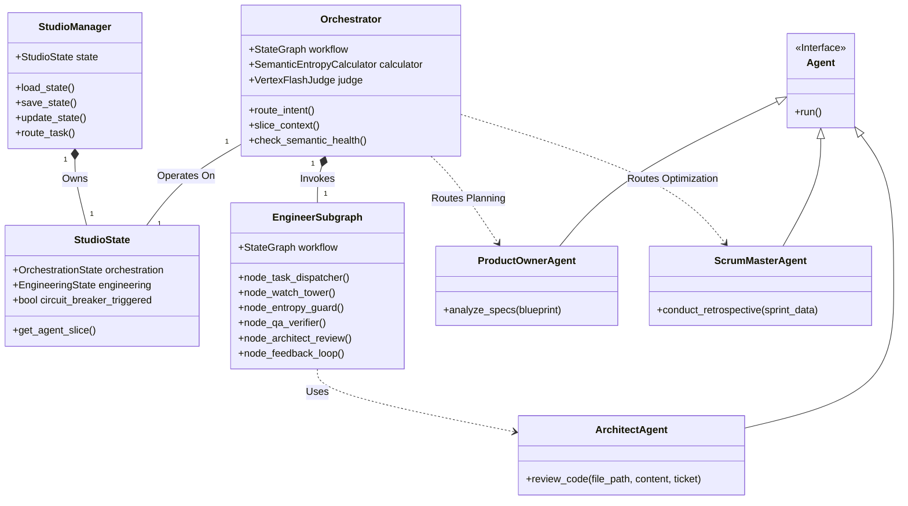
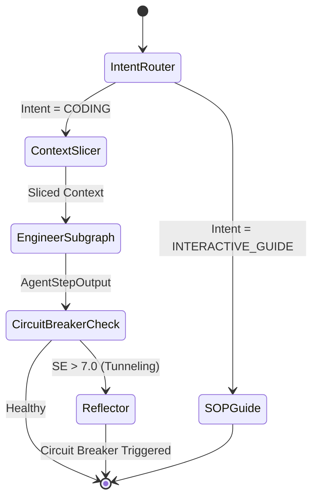
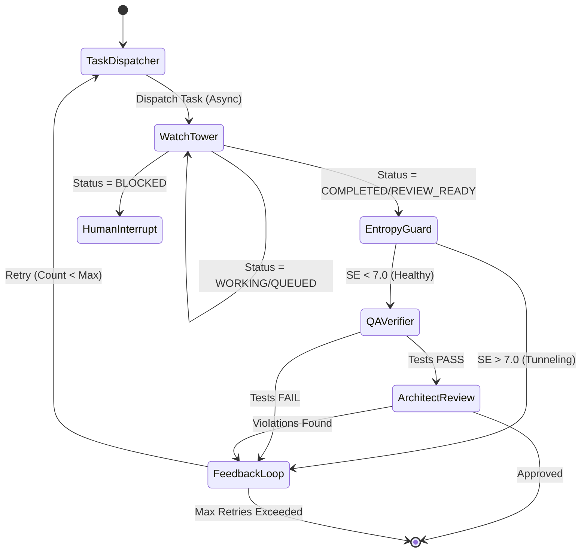

# Software Design Document - Studio Team

## Overview
The Studio is a "Recursive Cognitive Software Factory" designed to automate software engineering tasks with high reliability and low error amplification. It employs a **Centralized Architecture** where a central `Orchestrator` manages state transitions and routes tasks to specialized agents. The system emphasizes:
-   **Context Slicing**: Isolating agents with only the necessary information to prevent context collapse.
-   **Circuit Breakers**: Using "Semantic Entropy" to detect and interrupt cognitive tunneling (hallucination loops).
-   **State Sovereignty**: A single `StudioManager` owns the persistence layer (`studio_state.json`), ensuring data integrity.
-   **Micro-Loop Architecture**: The engineering process follows a strict Plan -> Execute -> Monitor -> Verify -> Feedback loop.

## System Architecture

The core of the system is the `Orchestrator`, which manages the workflow defined in a `LangGraph` state graph. The `StudioManager` handles the persistence of the `StudioState`. Agents are invoked as nodes within the graph or subgraphs.

### Class Diagram

### Key Components

1.  **StudioManager (`studio/manager.py`)**:
    -   **Role**: State Owner.
    -   **Responsibilities**: Handles loading/saving `studio_state.json`, ensuring atomic writes, and initializing the default state.
2.  **Orchestrator (`studio/orchestrator.py`)**:
    -   **Role**: Runtime Executive.
    -   **Responsibilities**: Defines the high-level workflow graph, routes intents (Coding, Interactive Guide), and enforces the "Circuit Breaker" based on semantic entropy.
3.  **StudioState (`studio/memory.py`)**:
    -   **Role**: Single Source of Truth.
    -   **Responsibilities**: Pydantic models defining the entire system state, including orchestration status, engineering artifacts, and agent metadata.
4.  **EngineerSubgraph (`studio/subgraphs/engineer.py`)**:
    -   **Role**: The "Worker" implementation.
    -   **Responsibilities**: Manages the lifecycle of an engineering task, from dispatch to verification and review.

## Workflows

### 1. Orchestration Flow

The Orchestrator determines the high-level intent based on the triage status and routes to the appropriate subgraph. It uses Context Slicing to prepare data for the Engineer.

### 2. Engineer Subgraph Flow (The Micro-Loop)

The Engineering process is a self-correcting loop involving asynchronous execution, semantic monitoring, and rigorous verification.

## Agent Designs

### 1. Product Owner Agent (`studio/agents/product_owner.py`)
-   **Role**: The Planner.
-   **Responsibility**: Converts the `PRODUCT_BLUEPRINT.md` into actionable tickets.
-   **Key Logic**:
    -   Analyzes the Blueprint using Gemini-1.5-Pro.
    -   Generates a dependency-aware graph of tickets (`Ticket` objects).
    -   Performs **Topological Sort** to ensure tickets are executed in the correct order (Parents before Children).
    -   Checks for duplicate tickets against the existing backlog.

### 2. Architect Agent (`studio/agents/architect.py`)
-   **Role**: The Quality Guard.
-   **Responsibility**: Enforces architectural integrity and SOLID principles.
-   **Key Logic**:
    -   Reads the system constitution (`AGENTS.md`) and hashes it for integrity.
    -   Reviews the **FULL** source code (not just diffs) to ensure holistic correctness.
    -   Uses a strict Pydantic parser to generate a `ReviewVerdict`.
    -   Rejects code that violates specific rules (SRP, DIP, Security), acting as a gatekeeper before merge.

### 3. Scrum Master Agent (`studio/agents/scrum_master.py`)
-   **Role**: The Optimizer.
-   **Responsibility**: Continuous improvement (Kaizen) of the agentic process.
-   **Key Logic**:
    -   Analyzes Sprint Logs (Success/Failure rates, Entropy Scores).
    -   Identifies recurring failure patterns (e.g., "Engineer ignores security").
    -   Generates `ProcessOptimization` suggestions (OPRO) to update system prompts.
    -   Produces a `RetrospectiveReport` at the end of each sprint.

### 4. Engineer (Jules Proxy) (`studio/subgraphs/engineer.py`)
-   **Role**: The Worker.
-   **Responsibility**: Asynchronous implementation of coding tasks.
-   **Key Logic**:
    -   **Task Dispatcher**: Context Slicing to prepare a minimal effective context.
    -   **Watch Tower**: Polls the remote Jules worker for status updates.
    -   **Entropy Guard**: Calculates Semantic Entropy (SE) to detect cognitive tunneling.
    -   **QA Verifier**: Runs functional tests in a `DockerSandbox`.
    -   **Feedback Loop**: Analyzes failures and retries with specific instructions.

## Data Models (`studio/memory.py`)

The system relies on strict Pydantic schemas to enforce state integrity.

-   **StudioState**: The root state object containing `OrchestrationState` and `EngineeringState`.
-   **ContextSlice**: A subset of files and logs passed to agents to prevent context collapse.
-   **SemanticHealthMetric**: Tracks `entropy_score` (0.0-10.0) and `is_tunneling` status.
-   **Ticket**: Represents a unit of work with fields for `id`, `dependencies`, and `status`.
-   **ReviewVerdict**: The output of the Architect's review, containing a list of `Violation`s.
-   **JulesMetadata**: Tracks the state of the asynchronous engineer session (`session_id`, `status`, `retry_count`).
