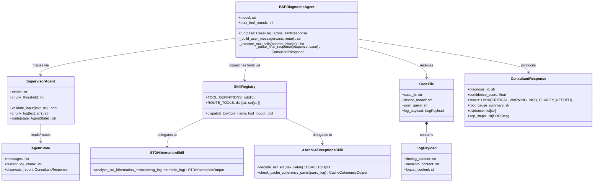
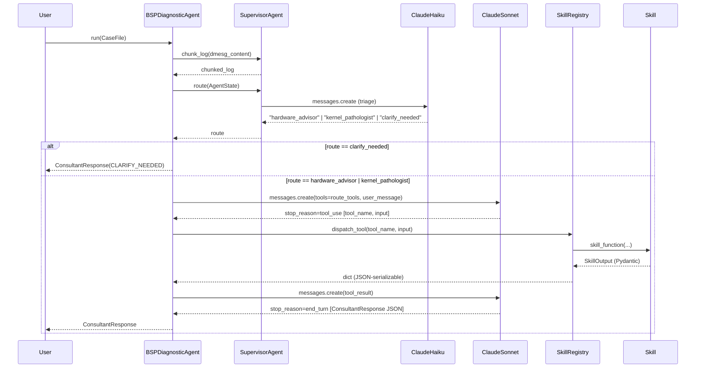

# Software Design Document — Android BSP Diagnostic Expert (v6)

## Overview

The system has pivoted from a "Recursive Cognitive Software Factory" to a **Skill-Based Expert Agent** using the Anthropic Tool-Use paradigm. It is designed to automate complex embedded systems diagnostics (Android BSP issues) with high reliability and low error amplification. It employs a **Three-Layer Architecture** where a central reasoning engine delegates fact-finding to deterministic tools.

The system emphasizes:
- **Accuracy over Autonomy**: Never guessing hardware state; always using a Tool to extract the truth.
- **Deterministic Execution**: Strict separation of reasoning (LLM) and data extraction (Python Tools).
- **Skill Registry**: A collection of isolated, deterministic Python functions with strict Pydantic schemas.
- **Route-Aware Tool Selection**: The Supervisor's routing decision limits which tools the Brain is offered, reducing noise and token cost.

---

## System Architecture

Three distinct layers: **The Brain** (LLM reasoning), **The Skill Registry** (deterministic tools), and **The Knowledge Base** (Markdown domain docs).

### Class Diagram

```mermaid
classDiagram
    class BSPDiagnosticAgent {
        +model: str
        +max_tool_rounds: int
        +run(case: CaseFile) ConsultantResponse
        -_build_user_message(case, route) str
        -_execute_tool_calls(content_blocks) list
        -_parse_final_response(response, case) ConsultantResponse
    }

    class SupervisorAgent {
        +model: str
        +chunk_threshold: int
        +validate_input(text: str) bool
        +chunk_log(text: str) str
        +route(state: AgentState) str
    }

    class SkillRegistry {
        +TOOL_DEFINITIONS: list[dict]
        +ROUTE_TOOLS: dict[str, set[str]]
        +dispatch_tool(tool_name, tool_input) dict
    }

    class STDHibernationSkill {
        +analyze_std_hibernation_error(dmesg_log, meminfo_log) STDHibernationOutput
    }

    class AArch64ExceptionsSkill {
        +decode_esr_el1(hex_value) ESREL1Output
        +check_cache_coherency_panic(panic_log) CacheCoherencyOutput
    }

    class CaseFile {
        +case_id: str
        +device_model: str
        +user_query: str
        +log_payload: LogPayload
    }

    class LogPayload {
        +dmesg_content: str
        +meminfo_content: str
        +logcat_content: str
    }

    class ConsultantResponse {
        +diagnosis_id: str
        +confidence_score: float
        +status: Literal[CRITICAL, WARNING, INFO, CLARIFY_NEEDED]
        +root_cause_summary: str
        +evidence: list[str]
        +sop_steps: list[SOPStep]
    }

    class AgentState {
        +messages: list
        +current_log_chunk: str
        +diagnosis_report: ConsultantResponse
    }

    BSPDiagnosticAgent --> SupervisorAgent : triages via
    BSPDiagnosticAgent --> SkillRegistry : dispatches tools via
    BSPDiagnosticAgent --> CaseFile : receives
    BSPDiagnosticAgent --> ConsultantResponse : produces
    SupervisorAgent --> AgentState : reads/routes
    CaseFile *-- LogPayload : contains
    SkillRegistry --> STDHibernationSkill : delegates to
    SkillRegistry --> AArch64ExceptionsSkill : delegates to
```

### End-to-End Sequence Diagram

```mermaid
sequenceDiagram
    participant User
    participant BSPDiagnosticAgent
    participant SupervisorAgent
    participant ClaudeHaiku
    participant ClaudeSonnet
    participant SkillRegistry
    participant Skill

    User->>BSPDiagnosticAgent: run(CaseFile)

    BSPDiagnosticAgent->>SupervisorAgent: chunk_log(dmesg_content)
    SupervisorAgent-->>BSPDiagnosticAgent: chunked_log

    BSPDiagnosticAgent->>SupervisorAgent: route(AgentState)
    SupervisorAgent->>ClaudeHaiku: messages.create (triage)
    ClaudeHaiku-->>SupervisorAgent: "hardware_advisor" | "kernel_pathologist" | "clarify_needed"
    SupervisorAgent-->>BSPDiagnosticAgent: route

    alt route == clarify_needed
        BSPDiagnosticAgent-->>User: ConsultantResponse(CLARIFY_NEEDED)
    else route == hardware_advisor | kernel_pathologist
        BSPDiagnosticAgent->>ClaudeSonnet: messages.create(tools=route_tools, user_message)
        ClaudeSonnet-->>BSPDiagnosticAgent: stop_reason=tool_use [tool_name, input]

        BSPDiagnosticAgent->>SkillRegistry: dispatch_tool(tool_name, input)
        SkillRegistry->>Skill: skill_function(...)
        Skill-->>SkillRegistry: SkillOutput (Pydantic)
        SkillRegistry-->>BSPDiagnosticAgent: dict (JSON-serializable)

        BSPDiagnosticAgent->>ClaudeSonnet: messages.create(tool_result)
        ClaudeSonnet-->>BSPDiagnosticAgent: stop_reason=end_turn [ConsultantResponse JSON]
        BSPDiagnosticAgent-->>User: ConsultantResponse
    end
```

---

## Key Components

### 1. `BSPDiagnosticAgent` (`product/bsp_agent/agent.py`)
- **Role**: Orchestrates the full diagnostic session. Calls the Supervisor, selects route-appropriate tools, runs the Anthropic tool-use loop, and returns a validated `ConsultantResponse`.
- **Model**: `claude-sonnet-4-6` (configurable).
- **Constraint**: Never performs math, parses hex offsets, or calculates memory sizes — always delegates to Skills.
- **CLARIFY_NEEDED fallback**: Returned if Supervisor cannot triage, if Claude returns unparseable JSON, or if `max_tool_rounds` is exceeded.

### 2. `SupervisorAgent` (`product/bsp_agent/agents/supervisor.py`)
- **Role**: Fast triage router. Reads dmesg, validates that it is a kernel log, and routes to one of three destinations.
- **Model**: `claude-haiku-4-5-20251001` (low-cost, max_tokens=16 — returns a single routing token).
- **Routes**: `kernel_pathologist` (panics, null-pointers, oops), `hardware_advisor` (STD, watchdog, power management), `clarify_needed` (invalid or insufficient log).
- **Log chunking**: Extracts the Event Horizon (±10 s around detected failure timestamp) when logs exceed 50 MB. Falls back to last 5 000 lines.
- **Short-circuit**: If `validate_input()` fails (no kernel timestamp pattern), returns `clarify_needed` without calling the LLM.

### 3. Skill Registry (`skills/registry.py`)
- **`TOOL_DEFINITIONS`**: List of Anthropic-compatible tool dicts, auto-generated from each skill's Pydantic `Input` model via `model_json_schema()`.
- **`ROUTE_TOOLS`**: Maps supervisor routes to the set of tool names for that domain. The Brain uses this to offer only relevant tools to Claude per session, reducing noise and token cost.
- **`dispatch_tool(name, input_dict)`**: Routes by name to the correct skill function, returns a JSON-serialisable `dict`.

### 4. Skills (`skills/bsp_diagnostics/`)
- Pure Python functions — no side effects, no LLM calls, no global state.
- Every skill has strict Pydantic `Input` / `Output` schemas.
- Every skill has a corresponding isolated `pytest` in `tests/product_tests/` — no LLM invoked.

### 5. Product Schemas (`product/schemas/__init__.py`)
- `CaseFile` / `LogPayload` (`dmesg_content`, `meminfo_content`, `logcat_content`) — core input.
- `ConsultantResponse` / `SOPStep` — structured diagnostic output.
- `TriageReport`, `RCAReport` — intermediate diagnostic models.
- Agent I/O contracts: `SupervisorInput`, `PathologistOutput`, `HardwareAdvisorInput/Output`.

---

## Diagnostic Domains & Skill Inventory

### Domain 1: Suspend-to-Disk (STD) & Power Management
**Supervisor route:** `hardware_advisor`

| Skill | Function | Logic |
|---|---|---|
| `std_hibernation.py` | `analyze_std_hibernation_error` | Detects `Error -12 creating hibernation image`; evaluates `SUnreclaim / MemTotal` (>10% threshold) and `SwapFree == 0` |
| `vendor_boot.py` | `check_vendor_boot_ufs_driver` | Scans dmesg for ufshcd/ufs_qcom errors; classifies failure phase as probe, link_startup, or resume; raises confidence when STD restore context is detected |
| `pmic.py` | `check_pmic_rail_voltage` | Parses rpm-smd-regulator, qpnp-regulator, and generic regulator lines; detects OCP events and undervoltage conditions; supports dmesg + logcat |

### Domain 2: AArch64 Architecture & Exceptions
**Supervisor route:** `kernel_pathologist`

| Skill | Function | Logic |
|---|---|---|
| `aarch64_exceptions.py` | `decode_esr_el1` | Decodes ESR_EL1 bits [31:26] (EC), [25] (IL), [24:0] (ISS/DFSC/IFSC) against ARM DDI0487 tables |
| `aarch64_exceptions.py` | `check_cache_coherency_panic` | Regex scan for SError indicators, ARM64 SError messages, ESR_EL1 with EC=0x2F; confidence scales with indicator count |
| `watchdog.py` | `analyze_watchdog_timeout` | Detects soft lockup, hard lockup (NMI watchdog), and RCU stall events; extracts CPU, PID, process name, stuck duration, and call trace (handles kernel timestamp prefix) |

---

## Development Roadmap

### Phase 1 — Core Infrastructure ✓ DONE

All pieces of the v6 architecture are in place and tested (107 product tests passing).

| Item | Deliverable |
|---|---|
| Skill: `analyze_std_hibernation_error` | `skills/bsp_diagnostics/std_hibernation.py` — 14 tests |
| Skill Registry | `skills/registry.py` — `TOOL_DEFINITIONS`, `ROUTE_TOOLS`, `dispatch_tool()` — 11 tests |
| BSPDiagnosticAgent | `product/bsp_agent/agent.py` — tool-use loop, Supervisor integration, route-based tool selection |
| SupervisorAgent → Claude | Migrated from Vertex AI to `claude-haiku-4-5-20251001` — 11 tests |
| `LogPayload.meminfo_content` | Correct schema; `/proc/meminfo` and `logcat` no longer conflated |
| Skill: `decode_esr_el1` | `skills/bsp_diagnostics/aarch64_exceptions.py` — 14 tests |
| Skill: `check_cache_coherency_panic` | `skills/bsp_diagnostics/aarch64_exceptions.py` — 17 tests |

### Phase 2 — Runnable & Validated ✓ DONE

| # | Item | Deliverable |
|---|---|---|
| 5 | CLI entry point | `cli.py` — `python cli.py --dmesg <path> [--meminfo <path>] [--output <path>]` |
| 6 | End-to-end integration test | `tests/product_tests/test_integration.py` — 25 tests across 3 fixture scenarios (panic, watchdog, healthy boot) |
| 7 | Knowledge base docs | `docs/memory-reclamation.md`, `docs/aarch64-exceptions.md` — YAML-frontmatter scoped domain reference |

### Phase 3 — Expanded Domain Coverage ✓ DONE

| # | Item | Route | Description |
|---|---|---|---|
| 8 | Skill: `check_vendor_boot_ufs_driver` | `hardware_advisor` | Detect UFS driver load failures during STD restore phase — phase-classified (probe / link_startup / resume) — 16 tests |
| 9 | Skill: `analyze_watchdog_timeout` | `kernel_pathologist` | Parse softlockup / hardlockup / RCU stall events; extract CPU, PID, process name, stuck duration, call trace — 19 tests |
| 10 | Skill: `check_pmic_rail_voltage` | `hardware_advisor` | Extract PMIC rail voltages (rpm-smd, qpnp, generic) from logcat/dmesg; detect OCP and undervoltage events — 19 tests |
| 11 | Real-world log validation | — | Run against actual BSP logs; tune skill thresholds; document known edge cases and false positives |

---

## Development Protocol

See `AGENTS.md` §4 for the authoritative protocol. Summary:

1. **Tool Creation:** Humans write pure Python tools in `skills/bsp_diagnostics/`.
2. **Tool Testing:** Humans write isolated `pytest` cases in `tests/product_tests/` — no LLM invocation in tests.
3. **Registry Update:** Add tool to `TOOL_DEFINITIONS` and `ROUTE_TOOLS` in `skills/registry.py`; update `skills/SKILL.md`.
4. **Knowledge Updates:** Humans update `docs/` Markdown files for new hardware/kernel versions.
5. **No Self-Modification:** The Agent cannot modify `AGENTS.md`, its own Python source code, or its Tools.
