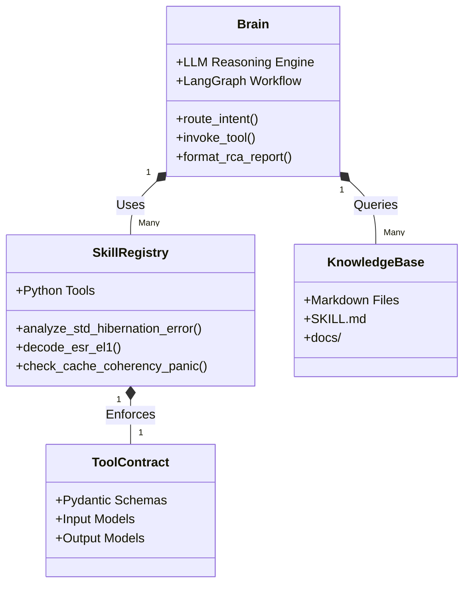

# Software Design Document - Android BSP Diagnostic Expert

## Overview
The system has pivoted from a "Recursive Cognitive Software Factory" to a **Skill-Based Expert Agent** using the Anthropic Tool-Use paradigm. It is designed to automate complex embedded systems diagnostics (like Android BSP issues) with high reliability and low error amplification. It employs a **Three-Layer Architecture** where a central reasoning engine delegates fact-finding to deterministic tools.

The system emphasizes:
-   **Accuracy over Autonomy**: Never guessing hardware state; always using a Tool to extract the truth.
-   **Deterministic Execution**: Strict separation of reasoning (LLM) and data extraction (Python Tools).
-   **Skill Registry**: A collection of isolated, deterministic Python functions with strict Pydantic schemas.
-   **Progressive Disclosure**: Using Markdown files to provide the LLM context only when needed.

## System Architecture

The core of the system is the reasoning engine (The Brain), which interacts with a set of deterministic tools (The Skill Registry) and a knowledge base (The Knowledge Base).

### Class Diagram

```mermaid
classDiagram
    class Brain {
        +LLM Reasoning Engine
        +LangGraph Workflow
        +route_intent()
        +invoke_tool()
        +format_rca_report()
    }

    class SkillRegistry {
        +Python Tools
        +analyze_std_hibernation_error()
        +decode_esr_el1()
        +check_cache_coherency_panic()
    }

    class KnowledgeBase {
        +Markdown Files
        +SKILL.md
        +docs/
    }

    class ToolContract {
        +Pydantic Schemas
        +Input Models
        +Output Models
    }

    Brain "1" *-- "Many" SkillRegistry : Uses
    Brain "1" *-- "Many" KnowledgeBase : Queries
    SkillRegistry "1" *-- "1" ToolContract : Enforces
```

### Key Components

1.  **The Brain (The Reasoning Engine)**:
    -   **Role**: To understand the user's intent, select the appropriate Tools, and format the final RCA report.
    -   **Implementation**: A streamlined LangGraph or direct LLM loop (Claude/Gemini).
    -   **Constraint**: The Brain must **never** attempt to do math, calculate memory sizes, or parse complex hex offsets directly. It MUST delegate these tasks to Tools.
2.  **The Skill Registry (The Tools)**:
    -   **Role**: Deterministic, testable scripts written by human domain experts.
    -   **Implementation**: Pure Python functions located in the `skills/` or `tools/` directory.
    -   **Contract**: Every tool MUST have a strict Pydantic schema for inputs and outputs.
3.  **The Knowledge Base**:
    -   **Role**: To provide the Brain with the necessary context *only when needed*.
    -   **Implementation**: Markdown files (e.g., `SKILL.md`, `docs/memory-reclamation.md`) containing deep architectural knowledge.

## Diagnostic Domains

The Agent is specialized in the following Android/Linux BSP domains:

### 1. Suspend-to-Disk (STD) & Power Management
* **Focus:** Analyzing failures during the `freeze`, `thaw`, `poweroff`, and `restore` phases.
* **Key Metrics:** `SUnreclaim` memory, Swap partition sizing, vendor_boot driver loading (UFS), and `dev_pm_ops` callback timing.

### 2. AArch64 Architecture & Exceptions
* **Focus:** Kernel Panics immediately following system resume or boot, such as NULL pointer dereferences and watchdog hard lockups.
* **Key Metrics:** Cache coherency (PoC) synchronization, CPU context restoration (X19-X29, PSTATE), and TrustZone (EL3) state coordination.
