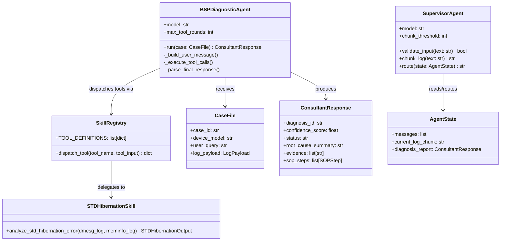
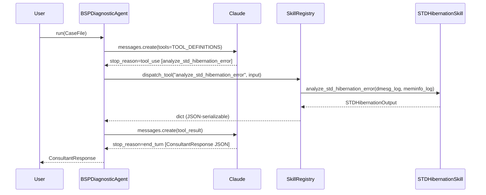

# Software Design Document — Android BSP Diagnostic Expert (v6)

## Overview
The system has pivoted from a "Recursive Cognitive Software Factory" to a **Skill-Based Expert Agent** using the Anthropic Tool-Use paradigm. It is designed to automate complex embedded systems diagnostics (Android BSP issues) with high reliability and low error amplification. It employs a **Three-Layer Architecture** where a central reasoning engine delegates fact-finding to deterministic tools.

The system emphasizes:
-   **Accuracy over Autonomy**: Never guessing hardware state; always using a Tool to extract the truth.
-   **Deterministic Execution**: Strict separation of reasoning (LLM) and data extraction (Python Tools).
-   **Skill Registry**: A collection of isolated, deterministic Python functions with strict Pydantic schemas.
-   **Progressive Disclosure**: Using Markdown files to provide the LLM context only when needed.

## System Architecture

The core of the system is the reasoning engine (The Brain), which interacts with a set of deterministic tools (The Skill Registry) and a knowledge base.

### Class Diagram

```mermaid
classDiagram
    class BSPDiagnosticAgent {
        +model: str
        +max_tool_rounds: int
        +run(case: CaseFile) ConsultantResponse
        -_build_user_message()
        -_execute_tool_calls()
        -_parse_final_response()
    }

    class SupervisorAgent {
        +model: str
        +chunk_threshold: int
        +validate_input(text: str) bool
        +chunk_log(text: str) str
        +route(state: AgentState) str
    }

    class SkillRegistry {
        +TOOL_DEFINITIONS: list[dict]
        +dispatch_tool(tool_name, tool_input) dict
    }

    class STDHibernationSkill {
        +analyze_std_hibernation_error(dmesg_log, meminfo_log) STDHibernationOutput
    }

    class CaseFile {
        +case_id: str
        +device_model: str
        +user_query: str
        +log_payload: LogPayload
    }

    class ConsultantResponse {
        +diagnosis_id: str
        +confidence_score: float
        +status: str
        +root_cause_summary: str
        +evidence: list[str]
        +sop_steps: list[SOPStep]
    }

    class AgentState {
        +messages: list
        +current_log_chunk: str
        +diagnosis_report: ConsultantResponse
    }

    BSPDiagnosticAgent --> SkillRegistry : dispatches tools via
    BSPDiagnosticAgent --> CaseFile : receives
    BSPDiagnosticAgent --> ConsultantResponse : produces
    SupervisorAgent --> AgentState : reads/routes
    SkillRegistry --> STDHibernationSkill : delegates to
```

### Tool-Use Sequence Diagram

```mermaid
sequenceDiagram
    participant User
    participant BSPDiagnosticAgent
    participant Claude
    participant SkillRegistry
    participant STDHibernationSkill

    User->>BSPDiagnosticAgent: run(CaseFile)
    BSPDiagnosticAgent->>Claude: messages.create(tools=TOOL_DEFINITIONS)
    Claude-->>BSPDiagnosticAgent: stop_reason=tool_use [analyze_std_hibernation_error]
    BSPDiagnosticAgent->>SkillRegistry: dispatch_tool("analyze_std_hibernation_error", input)
    SkillRegistry->>STDHibernationSkill: analyze_std_hibernation_error(dmesg_log, meminfo_log)
    STDHibernationSkill-->>SkillRegistry: STDHibernationOutput
    SkillRegistry-->>BSPDiagnosticAgent: dict (JSON-serializable)
    BSPDiagnosticAgent->>Claude: messages.create(tool_result)
    Claude-->>BSPDiagnosticAgent: stop_reason=end_turn [ConsultantResponse JSON]
    BSPDiagnosticAgent-->>User: ConsultantResponse
```

### Key Components

1.  **`BSPDiagnosticAgent`** (`product/bsp_agent/agent.py`):
    -   **Role**: Runs the Anthropic Claude tool-use loop; invokes Skills and returns a validated `ConsultantResponse`.
    -   **Model**: `claude-sonnet-4-6` (configurable).
    -   **Constraint**: Never performs math, parses hex offsets, or calculates memory sizes directly — always delegates to Skills.

2.  **`SupervisorAgent`** (`product/bsp_agent/agents/supervisor.py`):
    -   **Role**: Triage router that classifies incoming kernel logs and routes to `kernel_pathologist`, `hardware_advisor`, or `clarify_needed`.
    -   **Model**: `claude-haiku-4-5-20251001` (fast, low-cost triage).
    -   **Log chunking**: Extracts the Event Horizon (±10 s around detected failure) when logs exceed 50 MB.

3.  **Skill Registry** (`skills/registry.py`):
    -   **Role**: Holds `TOOL_DEFINITIONS` (Anthropic-compatible) auto-generated from Pydantic schemas, and the `dispatch_tool()` router.
    -   **Contract**: Every registered skill must have a Pydantic `Input`/`Output` model.

4.  **Skills** (`skills/bsp_diagnostics/`):
    -   Pure Python functions — no side effects, no LLM calls, no global state.
    -   Each skill has a corresponding isolated `pytest` in `tests/product_tests/`.

5.  **Product Schemas** (`product/schemas/__init__.py`):
    -   `CaseFile`, `LogPayload` — core input unit.
    -   `ConsultantResponse`, `SOPStep` — structured diagnostic output.
    -   `TriageReport`, `RCAReport` — intermediate diagnostic models.
    -   `SupervisorInput`, `PathologistOutput`, `HardwareAdvisorInput/Output` — agent I/O contracts.

6.  **`AgentState`** (`product/bsp_agent/core/state.py`):
    -   LangGraph-compatible `TypedDict` holding `messages`, `current_log_chunk`, and `diagnosis_report`.

## Diagnostic Domains

The Agent is currently specialized in the following Android/Linux BSP domains:

### 1. Suspend-to-Disk (STD) & Power Management
* **Focus:** Analyzing failures during the `freeze`, `thaw`, `poweroff`, and `restore` phases.
* **Key Metrics:** `SUnreclaim` memory, Swap partition sizing, vendor_boot driver loading (UFS), and `dev_pm_ops` callback timing.
* **Implemented Skill:** `analyze_std_hibernation_error` — detects `Error -12 creating hibernation image`, evaluates `SUnreclaim / MemTotal` ratio (threshold: 10%), and checks `SwapFree`.

### 2. AArch64 Architecture & Exceptions *(planned)*
* **Focus:** Kernel Panics immediately following system resume or boot, such as NULL pointer dereferences and watchdog hard lockups.
* **Key Metrics:** Cache coherency (PoC) synchronization, CPU context restoration (X19-X29, PSTATE), and TrustZone (EL3) state coordination.

## Development Protocol

See `AGENTS.md` §4 for the authoritative protocol. Summary:

1.  **Tool Creation:** Humans write pure Python tools in `skills/bsp_diagnostics/`.
2.  **Tool Testing:** Humans write isolated `pytest` cases in `tests/product_tests/` — no LLM invocation.
3.  **Knowledge Updates:** Humans update `skills/SKILL.md` and `docs/` Markdown files.
4.  **No Self-Modification:** The Agent cannot modify `AGENTS.md`, its own Python source code, or its Tools.
